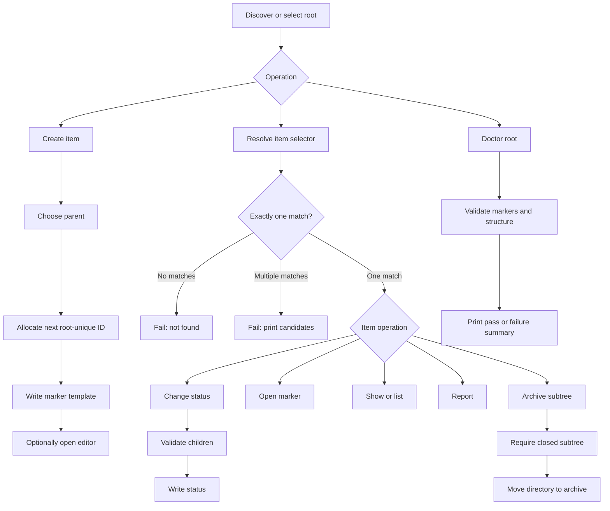

# Taskr MVP Workflows

MVP workflows are defined at behavior level. Concrete command names, arguments,
and flags are derived in the command-definition task.

All MVP workflows must be fully executable with only the Taskr CLI and a text
editor. A user must not need a web UI, generated sidecar database, or duplicate
entry of the same information to complete a workflow. Structured facts live in
the directory name, marker filename, or marker frontmatter; prose lives in the
marker body or in `files.md` containers.

# Shared Selector Workflow

Most item-oriented operations accept an item selector. The selector can match by
root-unique ID, directory slug, marker filename context, title, or marker/body
content.

Normal flow:

1. User provides a selector.
2. Taskr resolves it within the active root.
3. If exactly one item matches, the operation continues with that item.

Failure cases:

- No item matches: fail with a clear not-found message.
- More than one item matches: fail and print the matching candidates.
- A matched directory is structurally invalid: fail and point at the invalid
  path.

Expected output:

- Successful mutating operations print the affected item path and effective
  status.
- Ambiguous selector failures print enough candidate information for the user to
  choose a narrower selector.

# Create Item Workflow

User provides a work-item type and title, plus an optional parent selector.
Taskr creates the next root-unique ID, derives a slug from the title, creates
the item directory under the selected parent, writes the correct marker
template, and optionally opens the marker in the configured editor.

Normal flow:

1. Resolve the parent when one is provided.
2. Derive allowed hierarchy relationships from the existing root.
3. Validate that the requested type is allowed under that parent by the derived
   hierarchy.
4. Find the next numeric ID that is unused anywhere in the root.
5. Create `<next-id>-<slug>/`.
6. Create `milestone.md`, `task.md`, or `subtask.md` from the template.
7. Set initial status to `open` unless the user explicitly asks for another
   allowed initial status.
8. Open the marker in the editor when requested by config or option.

Failure cases:

- Parent selector is missing when required.
- Parent selector is ambiguous or not found.
- Requested type is not valid for the selected parent.
- Target directory already exists.
- Requested slug already exists for the same role in the root.
- Duplicate IDs already exist in the root; refuse every command except doctor
  and future repair.
- Editor launch fails after creation; report the created marker path.

Expected output:

- Created item path.
- Created root-unique item ID.
- Marker filename.
- Whether the editor was opened.

# Change Status Workflow

User selects an item and requests a new status. Taskr validates the transition
against the item's children before writing.

Normal flow:

1. Resolve the item selector.
2. Load the selected item and child tree.
3. Validate the requested status. `developing` is the normal state for active
   implementation, and `reviewing` is the normal state for work that is
   implemented and ready for user review.
4. If setting a parent item to `done`, verify all completion children are done.
5. If setting an item to `cancelled`, keep children unchanged unless the user
   explicitly requests a recursive cancellation workflow later.
6. Write the new status, update `updated_at`, and set the target status's
   optional `*_at` field to the same current UTC timestamp.
7. When moving from `done` or `cancelled` to a non-closed status, also set
   `reopened_at`.
8. If the requested status is already current, report a successful no-op and
   leave the marker unchanged.

Failure cases:

- Status is not allowed.
- User tries to mark a parent `done` while completion children are not done.
- Marker cannot be parsed or written.

Expected output:

- Old status and new status.
- Whether the status changed.
- Effective completion status.
- Blocking child paths when the requested status is rejected.

# Change Priority Workflow

User selects a task and changes its effective ordering priority.

Normal flow:

1. Resolve exactly one task selector.
2. Validate `high`, `normal`, or `low`.
3. Store `high` or `low`; remove priority metadata for effective `normal`.
4. Update `updated_at` for a real change.
5. Leave the marker byte-identical when the effective priority is unchanged.

Failure cases:

- Selector is missing, ambiguous, or resolves to a milestone or subtask.
- Priority is missing, invalid, or uses non-canonical case.
- Marker cannot be rewritten.

Expected output:

- Old and new effective priority.
- Whether the marker changed and whether priority metadata remains stored.

# Open Item Workflow

User selects an item and chooses to open it with the configured editor or system
opener. The default opener is the editor.

Normal flow:

1. Resolve the selector.
2. Select the marker file by default.
3. Open the marker with `$EDITOR` or the editor configured in personal Taskr
   config.
4. If user requests system opener, open through the platform opener.

Failure cases:

- Selector is missing, ambiguous, or not found.
- Editor/opener is not configured or exits non-zero.

Expected output:

- Path opened.
- Opener used.

# Show Workflow

User asks to inspect exactly one item. Taskr prints a human-readable view to
stdout and does not summarize sets of items.

Normal flow:

1. Resolve the required selector to exactly one item.
2. Print item identity, title, status, marker path, and the complete Markdown
   body.
3. With `--meta`, print marker metadata without the Markdown body.

Failure cases:

- Selector is not found.
- Selector is ambiguous; fail with a non-zero exit status and list every
  candidate by ID and title.
- Worktree is invalid.

Expected output:

- Stable text output suitable for Smokey assertions.
- Complete `# Description`, `# Acceptance`, `# Comments`, and `# Outcome`
  sections by default.
- Metadata fields without body sections when `--meta` is used.
- No editor or pager required for MVP.

# List Workflow

User asks to inspect the current root or a filtered set of items. Taskr prints
stable summary rows for all matching items.

# Report Workflow

User requests a repository report. Taskr summarizes the top-level root by
status and milestone, then writes the report to stdout or to a target file.

Normal flow:

1. Render a deterministic report with root summary, status statistics, and
   milestone sections.
2. List open milestones without tickets in their own section.
3. Use explicit headings when a list is truncated, for example a current-work
   section that shows five of a larger set.
4. Write to stdout unless a target file is provided.

Failure cases:

- Unsupported filter flags are rejected.
- Target file cannot be written.

Expected output:

- For stdout reports: deterministic text.
- For file reports: written path.

# Doctor Workflow

User validates the root. Taskr checks the worktree format from
`doc/taskr-worktree-format.md`.

Normal flow:

1. Discover or select root.
2. Walk directories outside `files.md` containers.
3. Validate marker count, marker format, required sections, ID prefixes,
   statuses, timestamps, root-unique IDs, per-role slug uniqueness, derived
   hierarchy consistency, and structural completion.
4. Print a summary.

Failure cases:

- Invalid root.
- Directory with zero or multiple recognized markers.
- Duplicate IDs.
- Duplicate slugs for the same role.
- Item whose parent/child role pair conflicts with the derived hierarchy.
- Invalid marker frontmatter or body sections.
- Invalid completion state.

Expected output:

- Pass summary with checked item count.
- Failure list with paths and concise reasons.

# Archive Workflow

User archives a completed subtree. Archive is a move, not a status change.

Normal flow:

1. Resolve the selected item.
2. Verify the selected subtree is closed (`done` or `cancelled`) and no active
   work remains inside it.
3. Move the whole directory below the root archive location. `--to 2026` means
   `archive/2026` below the Taskr root.
4. Preserve marker files, outcomes, comments, children, and file containers.

Failure cases:

- Selected item or descendants are still active/open/designing/developing/reviewing/blocked.
- Destination already exists.
- Filesystem move fails.

Expected output:

- Source path.
- Destination path.
- Number of moved work items.
